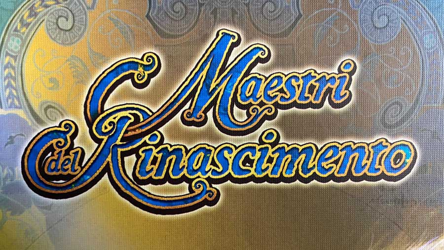

#Prova Finale di Ingegneria del Software - a.a. 2020-21
___

Java porting of [Maestri del Rinascimento](http://www.craniocreations.it/prodotto/masters-of-renaissance) 
(board game by [Cranio Creations](http://www.craniocreations.it)), 
final test of "Software Engineering" course at Politecnico di Milano.

Course held by: Alessandro Margara.

Developers: Davide Davanzo, Dario Del Gaizo, Alessandra de Stefano.

##About the project
___
The target of this project was to develop the software version of a chosen board game, 
using Java language to create a distributed system. This is composed of a single server connected to multiple clients.

More precisely, we were asked to implement an MVC design pattern and a TCP network using sockets.

##UML
___
- [initial UML]()
- [final UML]() (complete)
- [final UMLs]() (divided by packages)

##Functionalities
___
__Main ones__
-[x] Single-player match
-[x] Multi-player match (2 to 4) 
-[x] Socket connection
-[x] Cli
-[x] Gui

__Advanced (2)__
-[x] Multiple parallel matches
-[ ] Persistence
-[ ] Parameters editor
-[ ] Local match
-[x] Resilience to disconnections

##Run
___
First of all download the [jar]().

Server and clients use the same one, launching it differently.
- __Server__: download and double click on the [ServerApp.bat]() file or type from cmd line

        java -jar MaestriDelRinascimento.jar <port>
  
    Replace <port> with the port's number you want to use (e.g. 1234).\
    WARNING! CLIENTS MUST KNOW THIS NUMBER TO PLAY!
  

- __Client__: each client can choose independently to play using Cli or Gui.
    - __Gui__ --> download and double click on the [ClientGuiApp.bat]() file or type from cmd line
      
            java -jar MaestriDelRinascimento.jar <server_IP> <port>
    
        Replace <port> with the same number used by the server.\
        Replace <server_IP> with the IP number of the server host.
    - __Cli__ --> to be able to see every color and symbol used in this version download and configure WSL. To do so follow this [link](https://github.com/ingconti/W10JavaCLI). \
        Then type on Ubuntu Shell
        
            java -jar MaestriDelRinascimento.jar -cli <server_IP> <port>
      
        Replace <port> with the same number used by the server.\
        Replace <server_IP> with the IP number of the server host.
  
##Play
___
You can check the game's rules [here](src/main/resources/maestri-rules.pdf). Now you are ready to have fun!